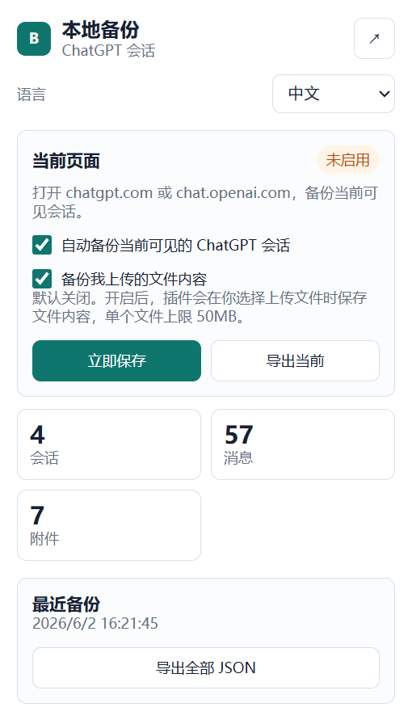
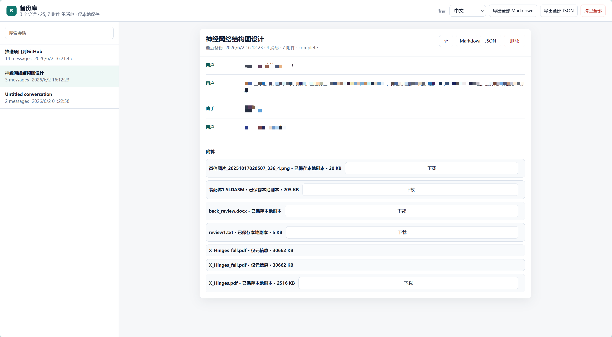

<div align="center">

# ChatGPT 本地备份

### Local-first ChatGPT conversation backup extension for Chrome / Edge

把你正在使用的 ChatGPT 会话实时保存到本地，避免重要聊天记录因为账号异常、误删或忘记导出而丢失。

<p>
  <a href="https://github.com/Yan-Haiyang-Tju/GPT-Export">
    
  </a>
  
  
  
</p>

**语言 / Language**: [简体中文](#简体中文) | [English](#english)

<br>



</div>

---

## 简体中文

### ✨ 它能做什么

ChatGPT 本地备份是一个 **Chrome / Edge 浏览器扩展**。安装后，它会在你打开 `chatgpt.com` 或 `chat.openai.com` 时，自动备份当前页面中可见的聊天内容到浏览器本地 IndexedDB。

它重点解决一个很具体的问题：

> 如果某一天账号突然异常、会话被误删、或者你忘了手动导出，至少已经打开过和正在进行的对话还能在本地找回来。

### 🖼️ 界面预览

<table>
  <tr>
    <td width="36%" align="center">
      <b>插件弹窗</b>
      <br><br>
      
    </td>
    <td width="64%" align="center">
      <b>备份库主界面</b>
      <br><br>
      
    </td>
  </tr>
</table>

### 🚀 功能亮点

- **自动备份**：保存当前可见的用户消息和 ChatGPT 回复。
- **生成中同步**：ChatGPT 回复生成过程中持续更新本地草稿。
- **历史会话补存**：手动打开历史会话后，备份页面中已加载的内容。
- **本地备份库**：查看、搜索、收藏、删除已备份会话。
- **多格式导出**：支持单个或全部会话导出 Markdown / JSON。
- **附件元信息**：保存可见图片、文件链接、上传文件的文件名、类型、大小等信息。
- **上传文件备份**：可选保存你上传的文件内容，默认关闭，单文件上限 50MB。
- **中英双语**：界面支持中文和 English，默认中文。
- **隐私优先**：默认本地保存，不上传云端。
- **合规克制**：不读取 cookies、密码、token，不调用 ChatGPT 私有接口，不后台批量爬历史。

### 📦 下载

#### 方式一：下载 ZIP，适合普通用户

1. 打开项目页面：

   ```text
   https://github.com/Yan-Haiyang-Tju/GPT-Export
   ```

2. 点击右上角 `Code`。
3. 点击 `Download ZIP`。
4. 解压下载好的 ZIP。
5. 找到解压后的项目目录，目录中应该能看到：

   ```text
   manifest.json
   src/
   pic/
   README.md
   ```

安装扩展时，请选择这个 **包含 `manifest.json` 的目录**。

#### 方式二：使用 Git，适合开发者

```shell
git clone https://github.com/Yan-Haiyang-Tju/GPT-Export.git
cd GPT-Export
```

安装扩展时，请选择 `GPT-Export` 目录。

### ⚡ 快速开始

#### Chrome

1. 打开 Chrome。
2. 访问：

   ```text
   chrome://extensions
   ```

3. 打开右上角 `Developer mode / 开发者模式`。
4. 点击 `Load unpacked / 加载已解压的扩展程序`。
5. 选择下载或克隆后的项目目录，也就是包含 `manifest.json` 的目录。
6. 打开 `https://chatgpt.com`，开始新会话或打开已有会话。

#### Edge

1. 打开 Microsoft Edge。
2. 访问：

   ```text
   edge://extensions
   ```

3. 打开 `Developer mode / 开发者模式`。
4. 点击 `Load unpacked / 加载已解压的扩展程序`。
5. 选择下载或克隆后的项目目录，也就是包含 `manifest.json` 的目录。
6. 打开 `https://chatgpt.com` 并正常使用。

### 🧭 使用指南

#### 1. 自动备份

安装扩展后，打开 ChatGPT 会话页面。页面右下角会出现备份状态：

```text
备份：监听中
备份：保存中
备份：已保存 6 条消息
备份：已保存 6 条消息，2 个附件
```

默认情况下，`自动备份当前可见的 ChatGPT 会话` 是开启的。

#### 2. 插件弹窗

点击浏览器右上角扩展图标，可以看到：

- 当前页面是否已识别。
- 自动备份开关。
- 上传文件内容备份开关。
- 本地已保存的会话数、消息数、附件数。
- 最近一次备份时间。
- `立即保存`。
- `导出当前`。
- 进入备份库。

#### 3. 备份历史会话

插件不会后台批量翻历史记录。  
如果你想备份某个历史会话，请手动打开该会话，等待内容加载完成，插件会保存当前页面中可见的内容。

#### 4. 备份上传文件

上传文件内容备份默认关闭。

如果你希望保存上传文件本体：

1. 点击扩展图标。
2. 开启 `备份我上传的文件内容`。
3. 再回到 ChatGPT 页面选择并上传文件。

说明：

- 单个上传文件上限为 50MB。
- 关闭时只保存文件名、大小、类型等元信息。
- 如果先上传文件再开启开关，已经上传过的文件不会被回头读取，需要重新选择上传。

#### 5. 备份库

点击插件弹窗右上角箭头按钮，可以打开备份库。

备份库中可以：

- 查看所有已备份会话。
- 搜索会话。
- 收藏重要会话。
- 删除本地备份。
- 下载已保存的附件副本。
- 导出单个会话为 Markdown / JSON。
- 导出全部会话为 Markdown / JSON。

### 🔄 更新

#### ZIP 用户

1. 到 GitHub 页面重新点击 `Code` -> `Download ZIP`。
2. 解压新的 ZIP。
3. 打开 `chrome://extensions` 或 `edge://extensions`。
4. 找到本扩展并点击刷新按钮。
5. 如果你更换了解压目录，请重新点击 `Load unpacked` 并选择新的项目目录。

#### Git 用户

```shell
cd GPT-Export
git pull
```

然后回到 `chrome://extensions` 或 `edge://extensions`，点击扩展卡片上的刷新按钮。

### 🧹 卸载和清理

清空本地备份：

1. 打开备份库。
2. 点击 `清空全部`。

卸载扩展：

1. 打开 `chrome://extensions` 或 `edge://extensions`。
2. 找到 `ChatGPT 本地备份`。
3. 点击 `Remove / 删除`。

> 卸载扩展可能会同时清除扩展本地数据。卸载前建议先导出 JSON 备份。

### 🔐 隐私边界

默认情况下，数据只保存在当前浏览器配置的本地 IndexedDB 中。插件只在你主动导出时使用浏览器下载能力生成 Markdown 或 JSON 文件。

插件不会读取或保存：

- ChatGPT 账号密码
- cookies
- token
- 浏览器历史记录
- 其他网站内容

上传文件内容备份默认关闭。开启后，插件只会在你选择上传文件时读取文件内容，并保存到当前浏览器本地 IndexedDB。

### ⚠️ 当前限制

- 只能备份插件安装并启用之后产生或打开过的会话。
- 历史会话需要手动打开，且内容已经加载到页面中，插件才能备份。
- 如果账号已经无法访问，且某些会话此前从未备份过，插件无法恢复这些内容。
- ChatGPT 页面结构变化后，可能需要更新 `src/content.js`。
- 文件下载链接如果需要账号权限或已经过期，插件可能只能保存元信息。
- 图片地址如果需要额外账号权限、已经过期、无法直接读取或文件过大，插件可能只能保存元信息。
- GPT Image 生成图目前不保证总能保存本体。
- Canvas、语音等内容暂不完整支持。

### 🗂️ 项目结构

```text
manifest.json
src/
  content.js
  db.js
  export.js
  i18n.js
  popup.html
  popup.js
  service-worker.js
  styles.css
  vault.html
  vault.js
pic/
  主界面.png
  插件界面.png
```

---

## English

### ✨ What It Does

ChatGPT Local Backup is a **Chrome / Edge browser extension**. It automatically backs up the currently visible ChatGPT conversation into browser IndexedDB, then lets you view, search, and export saved conversations.

It is designed for one practical problem:

> If your account becomes unavailable, a conversation is deleted, or you forget to export data manually, conversations you have opened or are actively using can still be found locally.

### 🖼️ Interface Preview

<table>
  <tr>
    <td width="36%" align="center">
      <b>Extension popup</b>
      <br><br>
      
    </td>
    <td width="64%" align="center">
      <b>Backup library</b>
      <br><br>
      
    </td>
  </tr>
</table>

### 🚀 Highlights

- **Auto backup**: saves visible user messages and ChatGPT responses.
- **Streaming sync**: updates the local draft while a response is still generating.
- **Old conversation support**: backs up loaded content when you open old conversations manually.
- **Local library**: view, search, favorite, and delete backed-up conversations.
- **Export**: export one or all conversations as Markdown / JSON.
- **Attachment metadata**: saves visible image, file link, and uploaded file metadata.
- **Uploaded file backup**: optional, off by default, 50MB per-file limit.
- **Bilingual UI**: Chinese and English, Chinese by default.
- **Privacy first**: local storage by default, no cloud upload.
- **Conservative behavior**: no cookies, passwords, tokens, private ChatGPT APIs, or background history crawling.

### 📦 Download

#### Option 1: Download ZIP

1. Open:

   ```text
   https://github.com/Yan-Haiyang-Tju/GPT-Export
   ```

2. Click `Code`.
3. Click `Download ZIP`.
4. Unzip the downloaded file.
5. Find the extracted project folder. It should contain:

   ```text
   manifest.json
   src/
   pic/
   README.md
   ```

When loading the extension, select the folder that contains `manifest.json`.

#### Option 2: Use Git

```shell
git clone https://github.com/Yan-Haiyang-Tju/GPT-Export.git
cd GPT-Export
```

When loading the extension, select the `GPT-Export` folder.

### ⚡ Quick Start

#### Chrome

1. Open Chrome.
2. Go to:

   ```text
   chrome://extensions
   ```

3. Enable `Developer mode`.
4. Click `Load unpacked`.
5. Select the downloaded or cloned folder that contains `manifest.json`.
6. Open `https://chatgpt.com` and start or open a conversation.

#### Edge

1. Open Microsoft Edge.
2. Go to:

   ```text
   edge://extensions
   ```

3. Enable `Developer mode`.
4. Click `Load unpacked`.
5. Select the downloaded or cloned folder that contains `manifest.json`.
6. Open `https://chatgpt.com` and use the extension.

### 🧭 Usage

#### 1. Auto Backup

After installation, open a ChatGPT conversation page. A small status badge appears in the lower-right corner:

```text
Backup: watching
Backup: saving
Backup: saved 6 messages
Backup: saved 6 messages, 2 attachments
```

Auto-backup is enabled by default.

#### 2. Extension Popup

Click the extension icon to see:

- Whether the current page is detected.
- Auto-backup switch.
- Uploaded file content backup switch.
- Local conversation, message, and attachment counts.
- Latest backup time.
- `Save now`.
- `Export current`.
- Button for opening the backup library.

#### 3. Back Up Old Conversations

The extension does not crawl all old conversations in the background.  
To back up an old conversation, open it manually and wait until its content is loaded.

#### 4. Back Up Uploaded Files

Uploaded file content backup is off by default.

To save uploaded file contents:

1. Click the extension icon.
2. Enable `Back up my uploaded file contents`.
3. Go back to ChatGPT and choose files to upload.

Notes:

- The per-file limit is 50MB.
- If the switch is off, only file metadata such as name, size, and type is saved.
- If you enable the switch after uploading a file, that file will not be read retroactively. Choose the file again if you want to save its content.

#### 5. Backup Library

Click the arrow button in the extension popup to open the backup library.

In the backup library, you can:

- View all backed-up conversations.
- Search conversations.
- Favorite important conversations.
- Delete local backups.
- Download saved attachment copies.
- Export one conversation as Markdown / JSON.
- Export all conversations as Markdown / JSON.

### 🔄 Update

#### ZIP Users

1. Open the GitHub project page.
2. Click `Code` -> `Download ZIP`.
3. Unzip the new ZIP file.
4. Go to `chrome://extensions` or `edge://extensions`.
5. Click the reload button on the extension card.
6. If you changed the extracted folder location, click `Load unpacked` again and select the new project folder.

#### Git Users

```shell
cd GPT-Export
git pull
```

Then go to `chrome://extensions` or `edge://extensions` and click the reload button on the extension card.

### 🧹 Uninstall And Clear Data

To clear local backup data:

1. Open the backup library.
2. Click `Clear all`.

To uninstall the extension:

1. Open `chrome://extensions` or `edge://extensions`.
2. Find `ChatGPT Local Backup`.
3. Click `Remove`.

> Uninstalling the extension may also remove its local browser data. Export JSON first if you need a permanent backup.

### 🔐 Privacy Model

By default, data stays in the local IndexedDB of the current browser profile. The extension uses the browser download API only when you explicitly export Markdown or JSON files.

The extension does not read or save:

- ChatGPT account passwords
- cookies
- tokens
- browser history
- content from unrelated websites

Uploaded file content backup is off by default. When enabled, the extension only reads file contents when you choose files to upload, then stores them in the local IndexedDB of the current browser profile.

### ⚠️ Current Limits

- It only backs up conversations after the extension is installed and active.
- It can back up old conversations only when you open them and their content is visible.
- It does not recover conversations from a locked or banned account if they were never backed up.
- Page structure changes on ChatGPT may require updating `src/content.js`.
- If a file download link requires account access or expires, the extension may only save metadata.
- If an image requires extra account authorization, has expired, cannot be fetched directly, or is too large, the extension may only save metadata.
- GPT Image outputs are not guaranteed to be saved as full local image copies yet.
- Canvas content and voice data are not fully supported yet.

### 🗂️ Project Structure

```text
manifest.json
src/
  content.js
  db.js
  export.js
  i18n.js
  popup.html
  popup.js
  service-worker.js
  styles.css
  vault.html
  vault.js
pic/
  主界面.png
  插件界面.png
```
